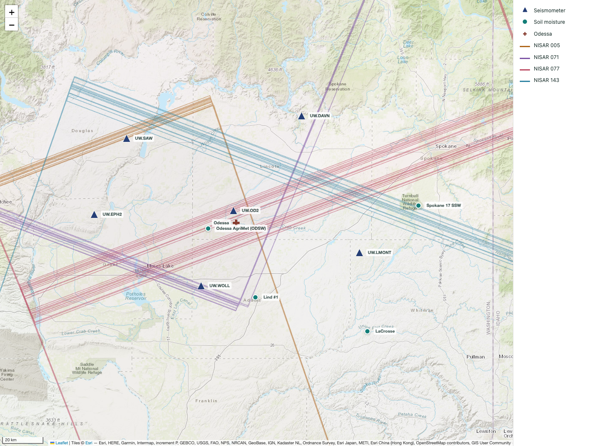

# soil-moisture-fusion

## Goal

We want to fuse the [NISAR SME2 soil moisture product](https://nisar-docs.asf.alaska.edu/sme2/) with in-situ seismic velocity change to produce gridded soil state with uncertainties.
We should be able to grid to the consumer's desired spatial and temporal resolution and propagate uncertainty accordingly. 
The pilot project in this repository aims to produce and validate spatially and temporally fused soil state in a small region around Odessa, WA. 

## Milestones

0. Literature review
1. Identify data sources, observation period, observation area and target spatial and temporal resolutions.
2. Temporally fuse NISAR SME2 with seismic dv/v at a single seismic station. Quantify uncertainty due to temporal upscaling of NISAR. Validate against ground-truth soil moisture sensors. 
3. Add spatial fusion across a small network of seismic stations. Quantify uncertainty due to spatial upscaling of seismic dv/v. Validate against ground-truth soil moisture sensors. 
4. Generalize fusion and uncertainty propagation to arbitrary spatial and temporal resolutions. Validate against ground-truth soil moisture sensors. 

## Environment setup

```
pixi shell
```

## Odessa data sources map

Interactive map of seismometers, soil moisture stations, and NISAR footprints around Odessa, WA.
Map inputs live in `data/station_map.json`; the generated HTML and PNG live in `outputs/`.

[](outputs/station_map.html)

## Related work

- Yu et al. (2025), [“Spatial Soil Moisture Prediction From In Situ Data Upscaled to Landsat Footprint: Assessing Area of Applicability of Machine Learning Models”](https://doi.org/10.1109/TGRS.2025.3565818), *IEEE TGRS*, 63. The study combines machine learning and spatiotemporal fusion to upscale in situ soil moisture to the Landsat footprint, showing that predictions within the models’ area of applicability have lower uncertainty. Provides an area-of-applicability assessment to identify where upscaled soil moisture predictions are more reliable.

- Kalaiselvi et al. (2026), [“Air quality prediction using multi-source remote sensing data integration with hybrid deep learning framework”](https://www.nature.com/articles/s41598-025-32466-0), *Scientific Reports*, 16, 2688. Fuses satellite imagery, meteorological data, and ground observations using a CNN–BiLSTM model with attention and predictive uncertainty estimates. Offers a framework for learning complementary spatial and temporal patterns across heterogeneous environmental observations while quantifying predictive uncertainty.

- Agata et al. (2025), [“Physics-informed deep learning quantifies propagated uncertainty in seismic structure and hypocenter determination”](https://www.nature.com/articles/s41598-024-84995-9), *Scientific Reports*, 15, 1846. Uses physics-informed neural network ensembles to estimate seismic velocity structure and propagate its uncertainty into earthquake hypocenter estimates, reducing bias and uncertainty underestimation. Provides an example of combining seismic data with physical constraints to quantify uncertainty in velocity estimates.

- Chao et al. (2026), [“A two-stage data fusion framework for multi-source precipitation estimates integrating gauge, radar, and satellite observations via deep learning and Bayesian model averaging”](https://doi.org/10.1016/j.jhydrol.2026.135764), *Journal of Hydrology*, 677, 135764. Combines 3D-CNN–ConvLSTM correction with Bayesian model averaging to fuse gauge, radar, and satellite precipitation into calibrated predictive distributions, evaluated at daily, hourly, and half-hourly resolutions. Evaluates probabilistic calibration and estimation performance across temporal resolutions and gauge densities.

- Zheng et al. (2026), [“A Bayesian INLA-SPDE approach to spatio-temporal point-grid fusion with change-of-support and misaligned covariates”](https://doi.org/10.1016/j.spasta.2026.100998), *Spatial Statistics*, 74, 100998. Uses a latent Gaussian field and source-specific observation operators to fuse point measurements and grid averages while accounting for differing spatial supports, temporal dependence, and measurement errors; demonstrates daily soil moisture mapping with uncertainty in Scotland. Offers a Bayesian framework for handling change of support and covariate misalignment with computationally efficient inference and uncertainty quantification.

- GAIA HazLab, [“GAIA Digital Twin of Soil”](https://gaia-hazlab.github.io/gwl-space-time-smooth/twin/), project documentation. Describes a coupled 90 m soil reanalysis for the Pacific Northwest that assimilates ground sensors and satellite observations to estimate water table depth, soil moisture, and near-surface stiffness. Provides the broader application context for this pilot, linking fused soil moisture and seismic observations to coupled soil states at resolutions required by downstream hazard models.

- Bensen et al. (2007), [“Processing seismic ambient noise data to obtain reliable broad-band surface wave dispersion measurements”](https://doi.org/10.1111/j.1365-246X.2007.03374.x), *Geophysical Journal International*, 169(3), 1239–1260. Describes ambient-noise preprocessing, cross-correlation and temporal stacking, surface-wave dispersion measurement, and quality control, using temporal repeatability to estimate measurement uncertainty. Provides methodological background for this project's seismic processing and uncertainty assessment.
